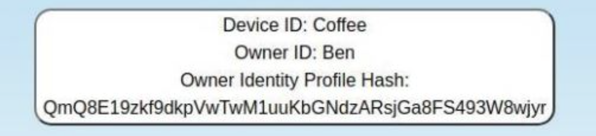
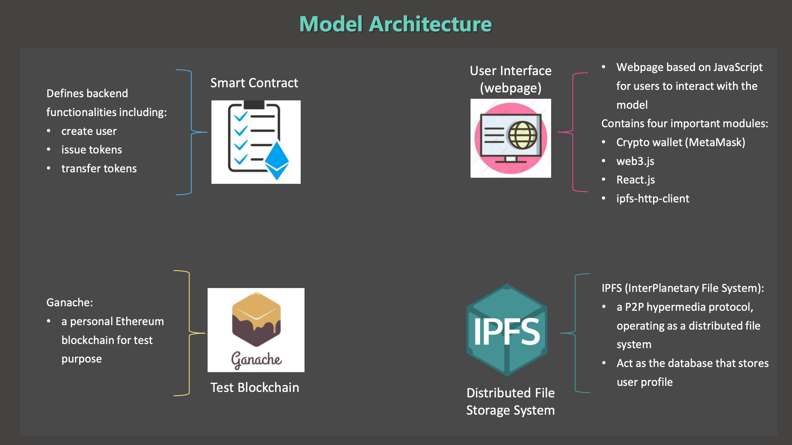
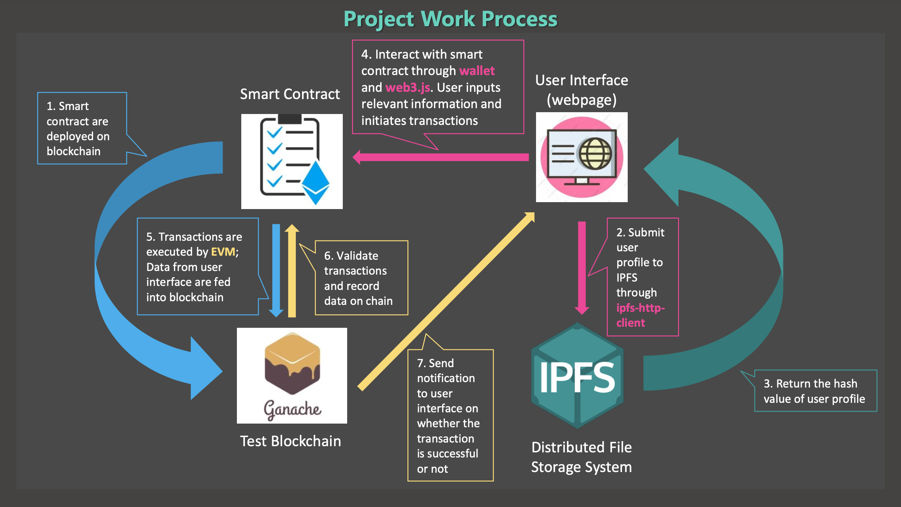
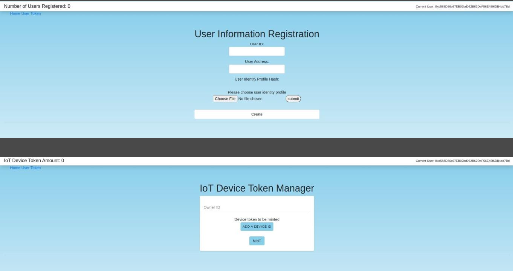

# IoT-Identity-Management-dApp

**IoT Identity Management project (IoT Token)** aims to explore the application possibility of utilizing the concept of NFT (Non-Fungible Token) standards such as **ERC-721** and **ERC-1155** to manage IoT devices.

In this model, a **smart contract** based on Ethereum will create a unique **ERC-1155 token** for each IoT device. The token contains device information (device ID) and the device’s owner information, including owner ID and the **IPFS** (InterPlanetary File System) hash value of the owner's profile. All this information will be recorded on blockchain.

Token example:

After issuing tokens to respective owners, the owner can also transfer the ownership of his/her token to another user, which means the owner of this device will be changed after transferring.

A frontend based on web3.js and React.js is also designed to illustrate the process, including a webpage for users to register their device, and another one for the manager to manage the registered devices.

[Detailed slides of the system design & workflow](https://drive.google.com/file/d/1KROeYTuvcb88unppRu9a7DrvvGbcPlOz/view?usp=sharing)

**Architecture:**

**Workflow:**

**Frontend:**

